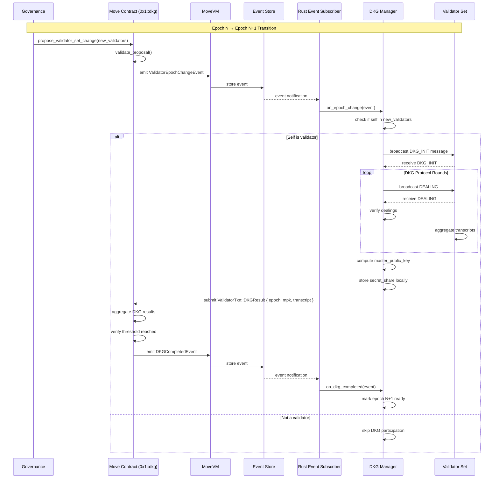
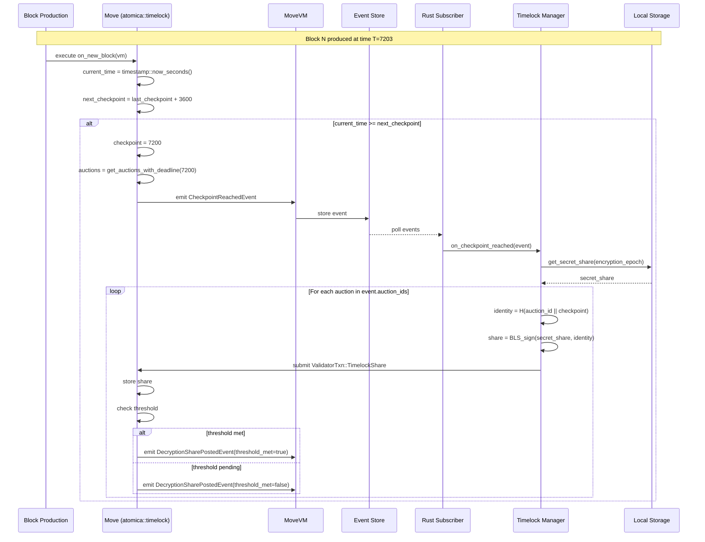
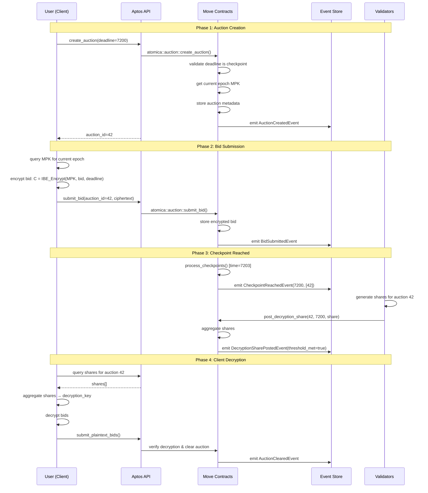

# Timelock Dataflow Specification

**Document Type**: Technical Specification
**Status**: Implementation Reference
**Last Updated**: 2026-01-06
**Purpose**: End-to-end dataflow through Rust validator → MoveVM → Events → Subscriptions

---

## Overview

This document specifies the complete dataflow for the Atomica timelock encryption system, from validator epoch changes through checkpoint processing to bid decryption.

**Key Flows Documented:**
1. Validator Epoch Transition (DKG Flow)
2. Checkpoint Processing (Decryption Share Generation)
3. Auction Lifecycle (Creation → Bidding → Decryption → Settlement)
4. Cross-Layer Communication (Rust ↔ Move)

> **Note**: This specification details the dataflow for the **Validator Layer**. In the full [Onion Timelock](onion-timelock.md) system, user clients may wrap this encryption in additional layers (Drand, Seller). The dataflow here describes how the Validator layer acts as one of those keys.

---

## 1. System Architecture Layers

```
┌─────────────────────────────────────────────────────────────────┐
│ Layer 5: User Applications (Web UI, CLI, SDK)                   │
│  - Bid encryption (client-side)                                 │
│  - Transaction submission                                       │
│  - Auction monitoring                                           │
└────────────────────────┬────────────────────────────────────────┘
                         │ HTTP/JSON-RPC
                         ▼
┌─────────────────────────────────────────────────────────────────┐
│ Layer 4: Aptos Full Node (REST API)                             │
│  - Transaction submission                                       │
│  - State queries                                                │
│  - Event streaming                                              │
└────────────────────────┬────────────────────────────────────────┘
                         │ Internal
                         ▼
┌─────────────────────────────────────────────────────────────────┐
│ Layer 3: Validator Node (Rust)                                  │
│  ┌──────────────────────────────────────────────────────────┐  │
│  │ Consensus (aptos-consensus)                              │  │
│  │  - Block production                                      │  │
│  │  - Transaction ordering                                  │  │
│  └──────────────────────────────────────────────────────────┘  │
│  ┌──────────────────────────────────────────────────────────┐  │
│  │ DKG Manager (aptos-dkg)                                  │  │
│  │  - Event subscription                                    │  │
│  │  - DKG protocol execution                                │  │
│  │  - Share generation                                      │  │
│  └──────────────────────────────────────────────────────────┘  │
│  ┌──────────────────────────────────────────────────────────┐  │
│  │ Mempool                                                   │  │
│  │  - ValidatorTransaction routing                          │  │
│  └──────────────────────────────────────────────────────────┘  │
└────────────────────────┬────────────────────────────────────────┘
                         │ VM Interface
                         ▼
┌─────────────────────────────────────────────────────────────────┐
│ Layer 2: MoveVM (Execution)                                      │
│  - Execute transactions                                         │
│  - Emit events                                                  │
│  - State updates                                                │
└────────────────────────┬────────────────────────────────────────┘
                         │ Native Functions
                         ▼
┌─────────────────────────────────────────────────────────────────┐
│ Layer 1: Move Contracts (On-Chain Logic)                        │
│  - 0x1::dkg (DKG coordination)                                  │
│  - atomica::timelock (Checkpoint management)                    │
│  - atomica::auction (Auction state)                             │
└─────────────────────────────────────────────────────────────────┘
```

---

## 2. Validator Epoch Transition Flow (DKG)

### 2.1 Sequence Diagram



### 2.2 Detailed Steps

#### Step 1: Governance Proposal (On-Chain)

**Location:** `0x1::stake::on_new_epoch()`

```move
public entry fun on_new_epoch(framework: &signer) {
    // Compute new validator set based on stake
    let new_validators = compute_next_validator_set();
    let old_epoch = get_current_epoch();
    let new_epoch = old_epoch + 1;

    // Update epoch state
    update_epoch(new_epoch, new_validators);

    // Emit event to trigger DKG
    event::emit(ValidatorEpochChangeEvent {
        old_epoch,
        new_epoch,
        new_validators: new_validators,
        threshold_voting_power: compute_threshold(&new_validators),
        total_voting_power: total_voting_power(&new_validators),
    });
}
```

**Output:**
- State change: `current_epoch` incremented
- Event emitted: `ValidatorEpochChangeEvent`
- Gas cost: ~50K units

#### Step 2: Event Subscription (Rust)

**Location:** `aptos-dkg/src/epoch_manager.rs`

```rust
impl EpochManager {
    pub async fn run(&mut self) -> Result<()> {
        // Subscribe to epoch change events
        let event_key = EventKey::new_from_address(
            &AccountAddress::ONE,
            TypeTag::Struct(Box::new(StructTag {
                address: AccountAddress::ONE,
                module: Identifier::new("dkg")?,
                name: Identifier::new("ValidatorEpochChangeEvent")?,
                type_args: vec![],
            })),
        );

        self.event_subscriber.subscribe(event_key, |event_bytes| {
            self.on_epoch_change(event_bytes)
        })?;

        // Poll for events in background
        loop {
            self.event_subscriber.poll_events().await?;
            tokio::time::sleep(Duration::from_secs(1)).await;
        }
    }

    fn on_epoch_change(&mut self, event_bytes: Vec<u8>) -> Result<()> {
        let event: ValidatorEpochChangeEvent = bcs::from_bytes(&event_bytes)?;

        info!(
            "Epoch transition: {} → {}, {} validators",
            event.old_epoch,
            event.new_epoch,
            event.new_validators.len()
        );

        // Check if I'm in the new validator set
        if !self.is_in_validator_set(&event.new_validators) {
            info!("Not in new validator set, skipping DKG");
            return Ok(());
        }

        // Start DKG protocol
        self.start_dkg_session(
            event.new_epoch,
            event.new_validators,
            event.threshold_voting_power,
        )
    }
}
```

**Transport:** Aptos Event Stream API (HTTP long-polling or WebSocket)

#### Step 3: DKG Protocol Execution (Off-Chain P2P)

**Location:** `aptos-dkg/src/dkg_manager.rs`

```rust
impl DKGManager {
    fn start_dkg_session(
        &mut self,
        epoch: u64,
        validators: Vec<ValidatorInfo>,
        threshold: u128,
    ) -> Result<()> {
        info!("Starting DKG session for epoch {}", epoch);

        // Setup DKG parameters
        let n = validators.len();
        let t = compute_threshold_count(threshold, &validators);

        // Create DKG instance
        let mut dkg = WeightedPVSS::new(
            n,
            t,
            validators.clone(),
        )?;

        // Phase 1: Generate dealing
        let dealing = dkg.generate_dealing(&mut rand::thread_rng())?;

        // Broadcast to other validators via P2P
        self.p2p_network.broadcast(DKGMessage::Dealing {
            epoch,
            sender: self.my_address,
            dealing,
        })?;

        // Phase 2: Collect dealings from others
        let dealings = self.collect_dealings(epoch, n, timeout)?;

        // Phase 3: Verify dealings
        for (sender, dealing) in dealings {
            dkg.verify_dealing(sender, &dealing)?;
        }

        // Phase 4: Aggregate transcript
        let transcript = dkg.aggregate_transcripts()?;

        // Phase 5: Extract keys
        let (master_pubkey, secret_share) = dkg.extract_keys(&transcript)?;

        // Store secret share locally (NEVER submit to chain!)
        self.storage.store_secret_share(epoch, secret_share)?;

        // Submit public data to chain
        self.submit_dkg_result(epoch, master_pubkey, transcript)?;

        Ok(())
    }

    fn submit_dkg_result(
        &self,
        epoch: u64,
        master_pubkey: Vec<u8>,
        transcript: Vec<u8>,
    ) -> Result<()> {
        // Create validator transaction
        let txn = ValidatorTransaction::DKGResult {
            epoch,
            master_public_key: master_pubkey,
            transcript,
        };

        // Submit to mempool
        self.mempool_client.submit_validator_transaction(txn)?;

        Ok(())
    }
}
```

**P2P Protocol:**
- Messages exchanged between validators
- NOT on-chain (happens off-chain)
- Uses validator P2P network
- Timeouts: 30 seconds per phase

#### Step 4: DKG Result Aggregation (On-Chain)

**Location:** `0x1::dkg::process_dkg_result()`

```move
public entry fun process_dkg_result(
    validator: &signer,
    epoch: u64,
    master_public_key: vector<u8>,
    transcript: vector<u8>,
) {
    // Verify caller is a validator
    assert!(is_validator(signer::address_of(validator)), E_NOT_VALIDATOR);

    // Verify epoch matches
    assert!(epoch == get_current_epoch(), E_INVALID_EPOCH);

    // Verify MPK format (BLS12-381 G2 point, 96 bytes)
    assert!(vector::length(&master_public_key) == 96, E_INVALID_MPK);

    // Store DKG contribution
    let contributions = borrow_global_mut<DKGContributions>(epoch);
    table::add(&mut contributions.results, signer::address_of(validator), DKGResult {
        master_public_key,
        transcript,
    });

    // Check if threshold reached
    let validator_set = get_validator_set(epoch);
    let voting_power = get_voting_power_submitted(contributions, &validator_set);
    let threshold = get_threshold_voting_power(&validator_set);

    if (voting_power >= threshold) {
        // DKG complete! Aggregate results
        let aggregated_mpk = aggregate_master_public_keys(contributions);

        // Store final MPK
        let state = borrow_global_mut<DKGState>(@aptos_framework);
        table::add(&mut state.master_public_keys, epoch, aggregated_mpk);

        // Emit completion event
        event::emit(DKGCompletedEvent {
            epoch,
            master_public_key: aggregated_mpk,
            num_validators: table::length(&contributions.results),
            threshold: compute_threshold_count(threshold, &validator_set),
            completion_time: timestamp::now_seconds(),
        });
    }
}
```

**Gas Cost:** ~500K units per validator submission

---

## 3. Checkpoint Processing Flow

### 3.1 Sequence Diagram



### 3.2 Detailed Steps

#### Step 1: Block Production Triggers Check

**Location:** `aptos-move/framework/aptos-framework/sources/block.move`

```move
module aptos_framework::block {
    fun block_prologue(
        vm: &signer,
        block_height: u64,
        block_timestamp: u64,
        proposer: address,
    ) {
        // Existing block logic
        update_timestamp(block_timestamp);
        distribute_rewards(proposer);

        // NEW: Check for timelock checkpoints
        atomica::timelock::process_checkpoints(vm);
    }
}
```

**Call frequency:** Every block (~1 second for Aptos)

#### Step 2: Checkpoint Detection

**Location:** `atomica-move-contracts/sources/timelock.move`

```move
module atomica::timelock {
    struct TimelockConfig has key {
        checkpoint_period: u64,           // e.g., 3600 (1 hour)
        last_processed_checkpoint: u64,
        current_epoch: u64,
        master_public_key: vector<u8>,
    }

    struct AuctionRegistry has key {
        // Maps deadline timestamp -> auction IDs
        auctions_by_deadline: Table<u64, vector<u64>>,
    }

    public entry fun process_checkpoints(vm: &signer) {
        // Only VM can call this
        assert!(signer::address_of(vm) == @vm, E_NOT_VM);

        let config = borrow_global_mut<TimelockConfig>(@atomica);
        let current_time = timestamp::now_seconds();
        let mut next_checkpoint = config.last_processed_checkpoint + config.checkpoint_period;

        // Process all checkpoints that have passed
        while (current_time >= next_checkpoint) {
            process_single_checkpoint(next_checkpoint, config.current_epoch);

            config.last_processed_checkpoint = next_checkpoint;
            next_checkpoint = next_checkpoint + config.checkpoint_period;
        }
    }

    fun process_single_checkpoint(checkpoint: u64, epoch: u64) {
        let registry = borrow_global<AuctionRegistry>(@atomica);

        // Check if any auctions expire at this checkpoint
        if (!table::contains(&registry.auctions_by_deadline, checkpoint)) {
            // No auctions at this checkpoint, skip
            return;
        }

        let auction_ids = table::borrow(&registry.auctions_by_deadline, checkpoint);

        // Emit event for validators
        event::emit(CheckpointReachedEvent {
            checkpoint_timestamp: checkpoint,
            block_height: block::get_current_block_height(),
            auction_ids: *auction_ids,
            encryption_epoch: epoch,
        });
    }
}
```

**Gas cost:** ~10K units if no auctions, ~50K if auctions present

#### Step 3: Validator Share Generation

**Location:** `aptos-dkg/src/timelock_manager.rs`

```rust
impl TimelockManager {
    pub fn on_checkpoint_reached(&mut self, event_bytes: Vec<u8>) -> Result<()> {
        let event: CheckpointReachedEvent = bcs::from_bytes(&event_bytes)?;

        info!(
            "Checkpoint {} reached, processing {} auctions",
            event.checkpoint_timestamp,
            event.auction_ids.len()
        );

        // Retrieve secret share for the encryption epoch
        let secret_share = self.storage
            .get_secret_share(event.encryption_epoch)
            .ok_or_else(|| anyhow!("No secret share for epoch {}", event.encryption_epoch))?;

        // Generate shares for all auctions at this checkpoint
        for auction_id in &event.auction_ids {
            self.generate_and_submit_share(
                *auction_id,
                event.checkpoint_timestamp,
                &secret_share,
            )?;
        }

        Ok(())
    }

    fn generate_and_submit_share(
        &self,
        auction_id: u64,
        checkpoint: u64,
        secret_share: &SecretShare,
    ) -> Result<()> {
        // Compute IBE identity
        let identity = self.compute_ibe_identity(auction_id, checkpoint);

        // Generate BLS signature on identity
        let signature_share = bls12381::sign(
            secret_share.as_scalar(),
            &identity,
        )?;

        // Create validator transaction
        let txn = ValidatorTransaction::TimelockShare(TimelockShareData {
            auction_id,
            checkpoint,
            share: signature_share.to_bytes(),
            validator_address: self.my_address,
        });

        // Submit to mempool
        self.mempool_client.submit_validator_transaction(txn)?;

        info!(
            "Submitted share for auction {} at checkpoint {}",
            auction_id, checkpoint
        );

        Ok(())
    }

    fn compute_ibe_identity(&self, auction_id: u64, checkpoint: u64) -> HashValue {
        // Canonical identity format
        let data = format!("auction:{}:deadline:{}", auction_id, checkpoint);
        HashValue::sha3_256(data.as_bytes())
    }
}
```

**Latency:** ~10-50ms per share generation (CPU-bound)

#### Step 4: Share Aggregation (On-Chain)

**Location:** `atomica-move-contracts/sources/timelock.move`

```move
module atomica::timelock {
    struct DecryptionShares has key {
        // Maps (auction_id, checkpoint) -> vector of shares
        shares: Table<AuctionCheckpointKey, vector<DecryptionShare>>,
    }

    struct DecryptionShare has copy, drop, store {
        validator_address: address,
        share: vector<u8>,  // BLS signature share (96 bytes)
    }

    public entry fun post_decryption_share(
        validator: &signer,
        auction_id: u64,
        checkpoint: u64,
        share: vector<u8>,
    ) {
        // Verify caller is validator
        let validator_addr = signer::address_of(validator);
        assert!(is_current_validator(validator_addr), E_NOT_VALIDATOR);

        // Verify share format
        assert!(vector::length(&share) == 96, E_INVALID_SHARE_SIZE);

        // Store share
        let key = create_key(auction_id, checkpoint);
        let shares_table = borrow_global_mut<DecryptionShares>(@atomica);

        if (!table::contains(&shares_table.shares, key)) {
            table::add(&mut shares_table.shares, key, vector::empty());
        }

        let shares = table::borrow_mut(&mut shares_table.shares, key);

        // Check for duplicate
        assert!(!has_validator_submitted(shares, validator_addr), E_DUPLICATE_SHARE);

        // Add share
        vector::push_back(shares, DecryptionShare {
            validator_address: validator_addr,
            share,
        });

        // Check threshold
        let validator_set = get_current_validator_set();
        let voting_power = compute_voting_power_from_shares(shares, &validator_set);
        let threshold = get_threshold_voting_power(&validator_set);
        let threshold_met = voting_power >= threshold;

        // Emit event
        event::emit(DecryptionSharePostedEvent {
            auction_id,
            checkpoint,
            validator_address: validator_addr,
            shares_received: vector::length(shares),
            threshold_required: compute_threshold_count(threshold, &validator_set),
            threshold_met,
        });
    }
}
```

**Gas cost:** ~100K units per share submission

---

## 4. Auction Lifecycle Flow

### 4.1 Complete Auction Sequence



### 4.2 Timing Analysis

```
Timeline for 1-hour checkpoint period:

T=0:     Auction created (deadline=3600)
         └─ Users begin encrypting/submitting bids

T=300:   More bids submitted
T=600:   More bids submitted
T=1800:  Bid submission continues
T=3000:  Final bids submitted
T=3600:  Bid deadline (no more bids accepted)

T=3601:  Block produced
         └─ process_checkpoints() called
         └─ CheckpointReachedEvent emitted

T=3602:  Validators receive event
         └─ Generate shares (parallel)
         └─ Submit shares to chain

T=3603-3620: Shares aggregated on-chain
             └─ Threshold reached
             └─ DecryptionSharePostedEvent(threshold_met=true)

T=3621:  Clients query shares
         └─ Aggregate shares
         └─ Decrypt bids

T=3622:  Clients submit plaintext bids
         └─ Auction clearing begins

T=3625:  Auction settled
         └─ AuctionClearedEvent emitted

Total latency from deadline to settlement: ~25 seconds
```

---

## 5. Cross-Layer Communication Contracts

### 5.1 Rust → Move Interface

#### ValidatorTransaction Types

**Location:** `aptos-types/src/validator_txn.rs`

```rust
#[derive(Debug, Clone, Serialize, Deserialize)]
pub enum ValidatorTransaction {
    /// DKG result submission
    DKGResult(DKGResultData),

    /// Timelock decryption share
    TimelockShare(TimelockShareData),

    // Existing variants...
    ObservedJWKUpdate(ObservedJWKs),
    DKGResult(DKGTranscript),  // Original DKG (for randomness)
}

#[derive(Debug, Clone, Serialize, Deserialize)]
pub struct DKGResultData {
    pub epoch: u64,
    pub master_public_key: Vec<u8>,  // 96 bytes (BLS12-381 G2)
    pub transcript: Vec<u8>,          // PVSS transcript
}

#[derive(Debug, Clone, Serialize, Deserialize)]
pub struct TimelockShareData {
    pub auction_id: u64,
    pub checkpoint: u64,
    pub share: Vec<u8>,               // 96 bytes (BLS12-381 G1)
    pub validator_address: AccountAddress,
}
```

#### Dispatch in MoveVM

**Location:** `aptos-move/aptos-vm/src/validator_txns/mod.rs`

```rust
pub fn process_validator_transaction(
    vm: &AptosVM,
    txn: &ValidatorTransaction,
    state_view: &impl StateView,
) -> Result<VMOutput> {
    match txn {
        ValidatorTransaction::DKGResult(data) => {
            dkg::process_dkg_result(vm, data, state_view)
        }

        ValidatorTransaction::TimelockShare(data) => {
            timelock::process_timelock_share(vm, data, state_view)
        }

        // Other variants...
    }
}
```

**Location:** `aptos-move/aptos-vm/src/validator_txns/timelock.rs`

```rust
pub fn process_timelock_share(
    vm: &AptosVM,
    data: &TimelockShareData,
    state_view: &impl StateView,
) -> Result<VMOutput> {
    // Create Move function call
    let module_id = ModuleId::new(ATOMICA_ADDRESS, Identifier::new("timelock")?);
    let function = Identifier::new("post_decryption_share")?;

    let args = vec![
        MoveValue::U64(data.auction_id).simple_serialize()?,
        MoveValue::U64(data.checkpoint).simple_serialize()?,
        MoveValue::vector_u8(data.share.clone()).simple_serialize()?,
    ];

    // Execute as privileged transaction (vm signer)
    let session = vm.new_session(state_view);
    session.execute_function_bypass_visibility(
        &module_id,
        &function,
        vec![], // type args
        args,
        &AccountAddress::vm_reserved(), // vm signer
    )?;

    let changeset = session.finish()?;
    Ok(VMOutput::new(changeset, /* gas */ 0))
}
```

### 5.2 Move → Rust Interface

#### Native Function Calls

**Location:** `aptos-move/framework/aptos-stdlib/sources/cryptography/ibe.move`

```move
module aptos_std::ibe {
    /// Decrypt IBE ciphertext using aggregated shares
    /// Implemented as native function in Rust
    native public fun decrypt(
        ciphertext: vector<u8>,
        aggregated_share: vector<u8>,
    ): vector<u8>;

    /// Verify IBE encryption correctness
    native public fun verify_encryption(
        ciphertext: vector<u8>,
        master_public_key: vector<u8>,
        identity: vector<u8>,
    ): bool;
}
```

**Rust Implementation:**

**Location:** `aptos-move/framework/aptos-natives/src/cryptography/ibe.rs`

```rust
use aptos_gas_schedule::gas_params::natives::aptos_framework::*;
use aptos_native_interface::{
    safely_pop_arg, RawSafeNative, SafeNativeBuilder, SafeNativeContext, SafeNativeResult,
};
use blstrs::{G1Affine, G2Affine, Gt, Scalar};
use move_vm_types::{
    loaded_data::runtime_types::Type,
    values::Value,
};

/// Native implementation of IBE decryption
pub fn native_ibe_decrypt(
    context: &mut SafeNativeContext,
    _ty_args: Vec<Type>,
    mut args: VecDeque<Value>,
) -> SafeNativeResult<SmallVec<[Value; 1]>> {
    // Charge gas
    context.charge(IBE_DECRYPT_BASE)?;

    // Pop arguments
    let aggregated_share_bytes = safely_pop_arg!(args, Vec<u8>);
    let ciphertext_bytes = safely_pop_arg!(args, Vec<u8>);

    // Deserialize
    let ciphertext = deserialize_ibe_ciphertext(&ciphertext_bytes)?;
    let share = G1Affine::from_compressed(&aggregated_share_bytes.try_into()?)
        .ok_or_else(|| "Invalid share")?;

    // Compute decryption key: K = e(U, share)
    let u = ciphertext.u; // Ephemeral public key
    let key = blstrs::pairing(&u, &share);

    // Decrypt: plaintext = V ⊕ H(key)
    let key_hash = hash_gt_to_bytes(&key);
    let plaintext = xor_bytes(&ciphertext.v, &key_hash);

    Ok(smallvec![Value::vector_u8(plaintext)])
}

/// Register native functions
pub fn make_all() -> impl Iterator<Item = (String, RawSafeNative)> {
    let natives = [
        ("decrypt", native_ibe_decrypt as RawSafeNative),
        ("verify_encryption", native_ibe_verify as RawSafeNative),
    ];

    make_module_natives(natives)
}
```

**Gas Costs:**
- `ibe::decrypt`: ~50K gas units (pairing operation)
- `ibe::verify_encryption`: ~80K gas units (pairing + verification)

---

## 6. Error Handling & Recovery

### 6.1 Event Subscription Failures

```rust
impl EventSubscriber {
    pub async fn poll_with_retry(&mut self) -> Result<()> {
        const MAX_RETRIES: u32 = 5;
        const BACKOFF_BASE: u64 = 1000; // ms

        for attempt in 0..MAX_RETRIES {
            match self.poll_events().await {
                Ok(_) => return Ok(()),
                Err(e) => {
                    warn!("Event poll failed (attempt {}/{}): {}",
                          attempt + 1, MAX_RETRIES, e);

                    if attempt < MAX_RETRIES - 1 {
                        let backoff = BACKOFF_BASE * 2u64.pow(attempt);
                        tokio::time::sleep(Duration::from_millis(backoff)).await;
                    } else {
                        return Err(e);
                    }
                }
            }
        }

        unreachable!()
    }
}
```

### 6.2 Missed Checkpoint Recovery

```move
module atomica::timelock {
    /// Manually trigger missed checkpoint processing
    /// Can be called by anyone if checkpoint was missed
    public entry fun recover_missed_checkpoints(caller: &signer) {
        let config = borrow_global_mut<TimelockConfig>(@atomica);
        let current_time = timestamp::now_seconds();
        let mut next_checkpoint = config.last_processed_checkpoint + config.checkpoint_period;

        // Process all missed checkpoints
        while (current_time >= next_checkpoint) {
            process_single_checkpoint(next_checkpoint, config.current_epoch);
            config.last_processed_checkpoint = next_checkpoint;
            next_checkpoint = next_checkpoint + config.checkpoint_period;
        }
    }
}
```

### 6.3 Share Submission Timeout

```rust
impl TimelockManager {
    async fn submit_share_with_timeout(
        &self,
        auction_id: u64,
        checkpoint: u64,
        share: &[u8],
    ) -> Result<()> {
        let txn = ValidatorTransaction::TimelockShare(TimelockShareData {
            auction_id,
            checkpoint,
            share: share.to_vec(),
            validator_address: self.my_address,
        });

        // Try submission with timeout
        timeout(
            Duration::from_secs(30),
            self.mempool_client.submit_validator_transaction(txn)
        ).await??;

        Ok(())
    }
}
```

---

## 7. Performance Characteristics

### 7.1 Latency Breakdown

| Stage | Latency | Notes |
|-------|---------|-------|
| Checkpoint detection | 0-1s | Next block after deadline |
| Event emission | <10ms | In-block event store |
| Event polling (Rust) | 0-5s | Depends on poll interval |
| Share generation | 10-50ms | BLS signature (CPU) |
| Share submission | 100-500ms | Mempool → consensus |
| Share aggregation | 1-10s | Depends on validator count |
| **Total (checkpoint → shares ready)** | **5-20s** | Typical case |

### 7.2 Gas Costs

| Operation | Gas Units | USD (at $0.0001/unit) |
|-----------|-----------|----------------------|
| Auction creation | ~200K | $0.02 |
| Bid submission | ~100K | $0.01 |
| Checkpoint processing (per auction) | ~50K | $0.005 |
| Share submission | ~100K | $0.01 |
| Share aggregation (on-chain) | ~20K per share | $0.002 |
| IBE decryption (native) | ~50K | $0.005 |

**Example:** 10-auction checkpoint with 4 validators posting shares:
- Checkpoint processing: 10 × $0.005 = $0.05
- Validator shares: 40 × $0.01 = $0.40
- **Total:** ~$0.45

### 7.3 Throughput Limits

**Validators:**
- DKG: 1 per epoch (unlimited time)
- Share generation: 1000s per second (CPU-bound)
- P2P bandwidth: ~1 MB/s typical

**On-Chain:**
- Auctions per checkpoint: Limited by block gas (100M)
  - ~2000 auctions per checkpoint at 50K gas each
- Bids per auction: Unlimited (storage-bound)
- Checkpoints per day: 24 (for 1-hour period)

---

## 8. Monitoring & Observability

### 8.1 Metrics to Track

**Rust Validator:**
```rust
// aptos-dkg/src/metrics.rs

lazy_static! {
    pub static ref CHECKPOINT_EVENTS_RECEIVED: IntCounter =
        register_int_counter!(
            "timelock_checkpoint_events_received",
            "Number of checkpoint events received"
        ).unwrap();

    pub static ref SHARES_GENERATED: IntCounter =
        register_int_counter!(
            "timelock_shares_generated",
            "Number of decryption shares generated"
        ).unwrap();

    pub static ref SHARE_GENERATION_DURATION: Histogram =
        register_histogram!(
            "timelock_share_generation_duration_seconds",
            "Time to generate a decryption share"
        ).unwrap();

    pub static ref EVENT_PROCESSING_ERRORS: IntCounter =
        register_int_counter!(
            "timelock_event_processing_errors",
            "Number of event processing errors"
        ).unwrap();
}
```

**Move Contract:**
```move
module atomica::timelock_metrics {
    struct Metrics has key {
        total_checkpoints_processed: u64,
        total_shares_received: u64,
        total_auctions_decrypted: u64,
        missed_checkpoints: u64,
    }
}
```

### 8.2 Logging

**Structured Logging:**
```rust
info!(
    target: "timelock",
    checkpoint = %checkpoint_timestamp,
    auction_count = %auction_ids.len(),
    epoch = %encryption_epoch,
    "Processing checkpoint"
);

debug!(
    target: "timelock",
    auction_id = %auction_id,
    share_size = %share.len(),
    "Generated decryption share"
);

error!(
    target: "timelock",
    error = %error,
    checkpoint = %checkpoint,
    "Failed to generate share"
);
```

---

## 9. Testing Dataflow

### 9.1 End-to-End Test

```rust
#[tokio::test]
async fn test_complete_timelock_flow() {
    // Setup
    let swarm = create_test_swarm(4).await?; // 4 validators
    let mut event_subscriber = EventSubscriber::new(&swarm.validator(0).rest_api());

    // Step 1: Trigger epoch change
    swarm.trigger_epoch_change().await?;

    // Step 2: Wait for DKG completion
    wait_for_dkg_completion(&swarm, timeout).await?;

    // Step 3: Create auction with checkpoint deadline
    let auction_id = create_auction(&swarm, /*deadline=*/7200).await?;

    // Step 4: Submit encrypted bids
    for i in 0..5 {
        submit_encrypted_bid(&swarm, auction_id, i).await?;
    }

    // Step 5: Fast-forward to checkpoint
    swarm.fast_forward_time(7200).await?;

    // Step 6: Verify checkpoint event emitted
    let checkpoint_event = event_subscriber
        .wait_for_event::<CheckpointReachedEvent>(timeout)
        .await?;
    assert_eq!(checkpoint_event.checkpoint_timestamp, 7200);
    assert!(checkpoint_event.auction_ids.contains(&auction_id));

    // Step 7: Verify shares posted
    wait_for_threshold_shares(&swarm, auction_id, timeout).await?;

    // Step 8: Client decrypts bids
    let shares = query_decryption_shares(&swarm, auction_id).await?;
    let decryption_key = aggregate_shares(&shares)?;
    let bids = decrypt_all_bids(&encrypted_bids, &decryption_key)?;

    // Step 9: Verify auction clears
    assert_eq!(bids.len(), 5);
}
```

---

**End of Timelock Dataflow Specification**
